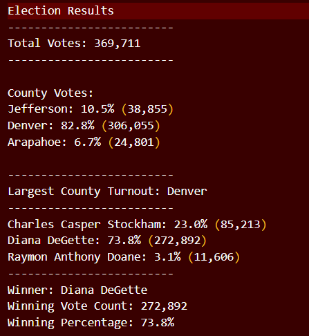
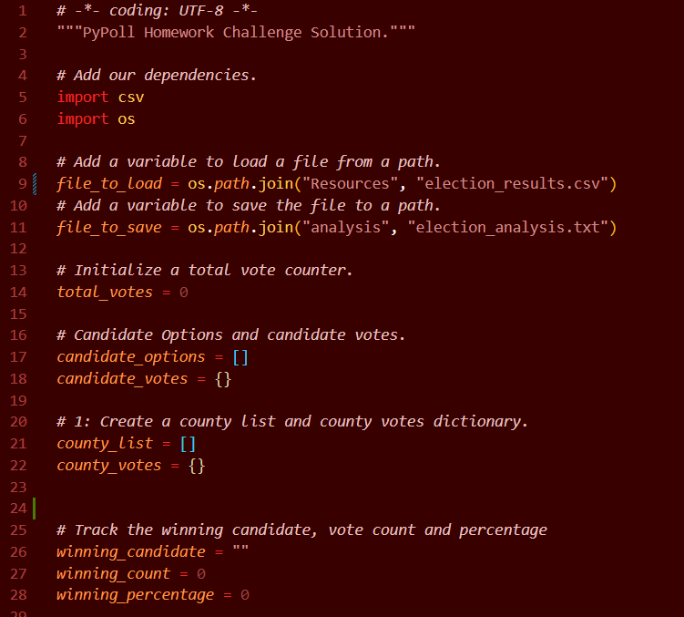
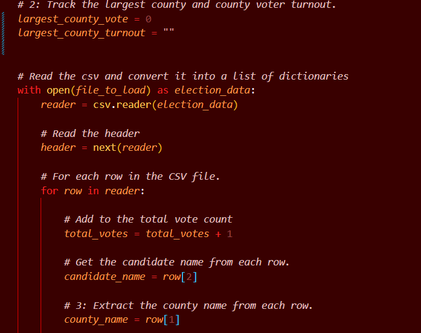
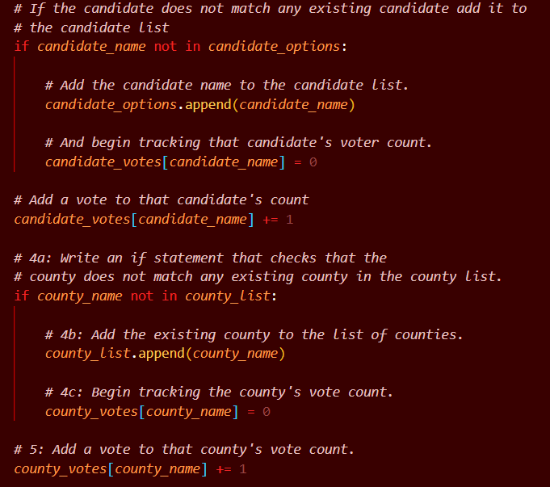
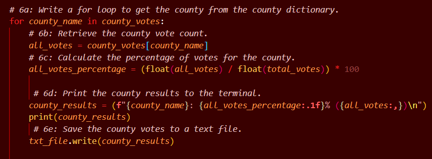
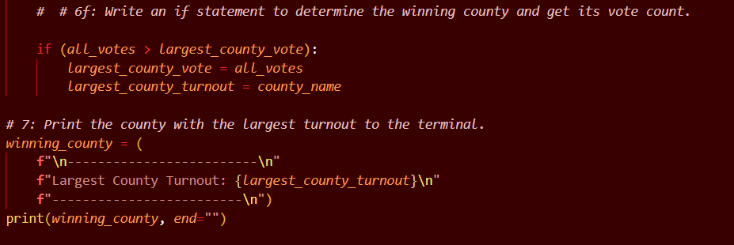
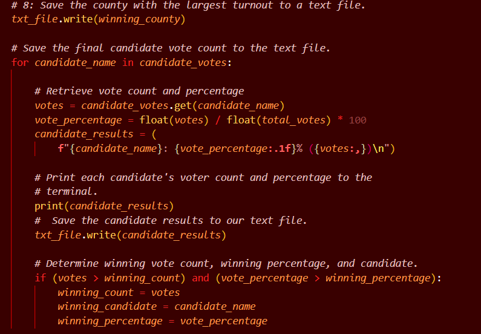
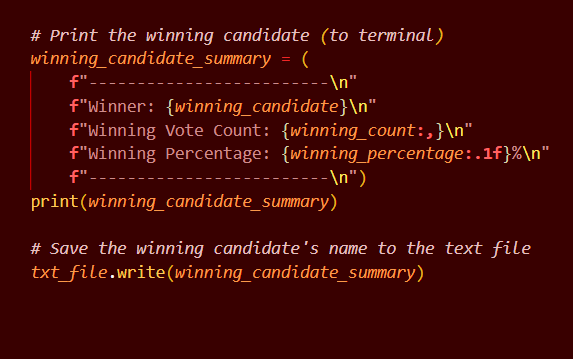

# Py Poll with Python
## Introduction
**This project focused on the use of for loops, conditional statements with membership and logical operators, and python packages to obtain election result data.**All data for this project came from a pre-entered CSV file for voting analysis specifying ballot ID, county, and candidate information. 
## Purpose
The goal of this project was to use python to aid in data analysis of election data reported in a CSV and output that analysis in a text file. This report will report how many votes were cast in the congressional election, provide a breakdown of the number of votes and percentage of total votes for each county in the precinct, which county had the largest number of votes, the number and percentage of votes for each candidate, and the statistics for the winning candidate. This report will also denote how the script can be used for other elections. The in-depth details of the python analysis methods to extract this data can be found in the appendix. 
## Results
**Total Votes**: 369,711
**Total Votes and Voting Percentage Per County**: 
    Jefferson: 10.5% (38,855)
    Denver: 82.8% (306,055)
    Arapahoe: 6.7% (24,801)
**Largest County Turnout**: Denver
**Candidate number of votes and percentage**:
    Charles Casper Stockham: 23.0% (85,213)
    Diana DeGette: 73.8% (272,892)
    Raymon Anthony Doane: 3.1% (11,606)
**Winning candidate statistics**:
    Winner: Diana DeGette
    Winning Vote Count: 272,892
    Winning Percentage: 73.8%
Below is an image of the former information in the out-putted txt file. Additionally, details of how this information was obtained can be found in the appendix section.

## Audit Summary
As seen in the former section this python script provides a detailed break down of election results in a clear and succinct manner. This script can be used with any election in the following ways. Let’s say a country would like to use this to report nation wide elections. An analyst can modify the script by changing anything that says county votes to say state votes. Additionally, if an election would like to display the information for a losing candidate they can repeat step 7 in the appendix but alter the variables denoted winner/winning to loser/loosing.
## Appendix
### Purpose
The goal of this project is to use the csv and os module in conjunction with logical operators, conditional statements, and for loops to obtain the following. Voter turnout for each county, percentage of votes from each county out of the total count, and the county with the highest turnout.
### Results
In order to obtain the desired election values the following steps were taken.
### Step 1

In this step we are importing our desired modules, setting up variables to load and save a csv file, initializing voter counts, creating lists and dictionaries for counties and candidate votes, and initializing candidate and county trackers.
CSV and os are the two modules used in this script for the following reasons. CSV allows you to pull CSV files into your script and os allows you to access files with out knowing the exact location of your file. This These modules are imported by using the command import then the name of module. 
The desired CSV file is stored in a folder called resources and is titled election_results.csv. Thus, to create a variable to load the file use we use our module os path and specify the location and name of the file then set it equal to the file_to_load variable. A similar process is then used for saving a new CSV file.
In order to initialize counts a variable is created then set to a string by putting “” or a numeric value by putting 0. Additionally, to create dictionaries a desired dictionary name is set equal to {}. As similar process is used for lists, except the name is set equal to [].
###Step 2

In this step we are extracting data from the CSV file. This is done by opening the csv file and setting it to a variable. Then using reader to access the contents of the csv file in read only so that the data will not be changed. A for loop is then initialized to read the contents of the file and establish data for each variable.  Variables were then to set to iterate through all votes, and locations of candidate name and county name in the csv file were specified.
### Step 3

Here we are appending our lists to add all counties and candidate names. This is done by the append command. Variables are also initialized here to correlate two variables in the csv file and iterate through them.
### Step 4

An f string is used here to set up a block of text stating election results, total votes, and county votes. It is important  to note that \n, f”, and print respectively ends a line of text, starts a new line in the f string, and prints the f string. In the third line of the f string the variable total_votes is used to print the overall total votes. Additionally, the txt_file.write(election_results) adds the contents of the f string to the txt file.
### Step 5

Here a for loop is initiated to gather the county name correlated with the number of votes tied to that county. This is done by setting the variable all_votes equal to county vote county by county_votes[county_name]. Then the variable all_votes_percentage was set to a floating-point number “float” by dividing the all votes count by the total number of votes. 
A new variable called county results is then printed to the terminal by using an f string composed of the county name, all votes percentage, and all votes for that county. The county results are then printed to the txt file by using a print statement and saving to the txt file using txt_file.write(county results). 
### Step 6

An if statement is then used to acquire the largest county vote and the largest county turnout. Then the winning county was found by using an f string to print out the largest county turnout and printed to the text file using a print statement. 
### Step 7

The winning county was then saved to the txt file using the write command. Then a for loop was initiated to get the final candidate vote count. This is done by imitating a for loop by pulling the candidate’s name from candidate votes. A variable called votes is used to get the candidate’s name from candidate votes using the get command. Then the voting percentage was retrieved via the same method used as before.  In F string candidate results were formed by utilizing candidate name, vote percentage, and votes.
This was then printed and saved to the txt file using the write function. Then an if statement is implemented to determine the winning vote count, winning candidate, and winning percentage. The former was then printed in a winning candidate summary using an f string and print statement then saves to the txt file using the write function.
